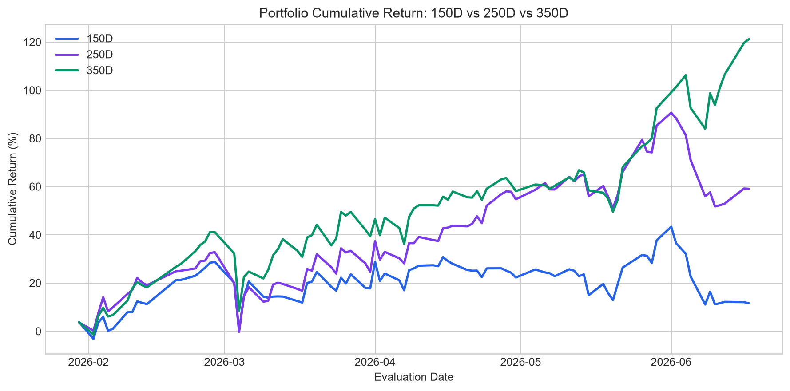
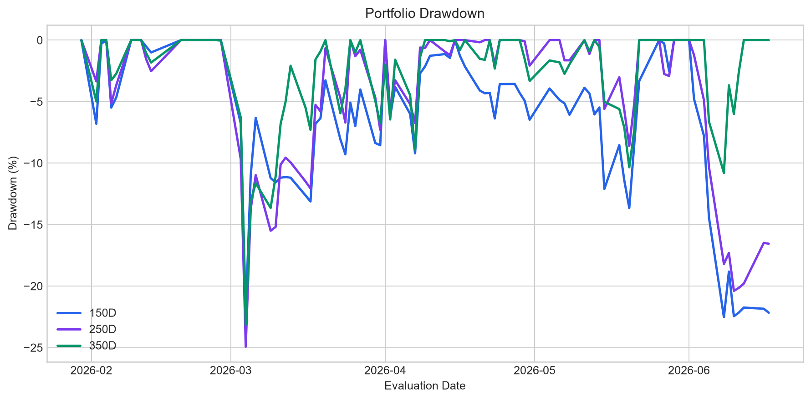
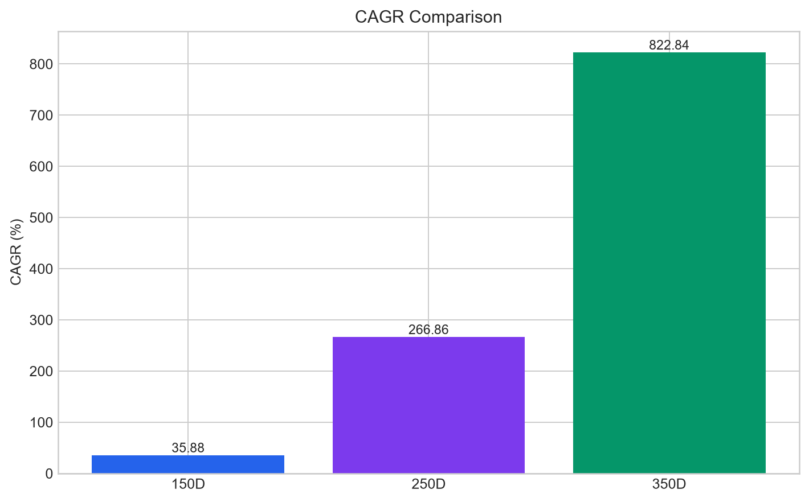
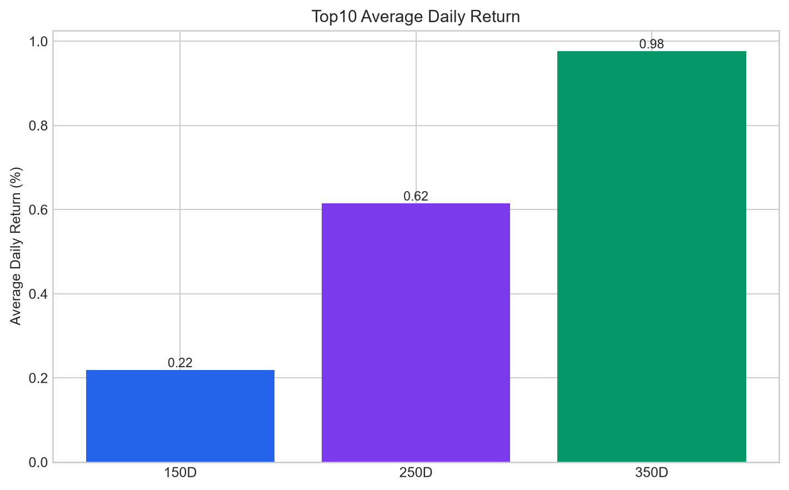
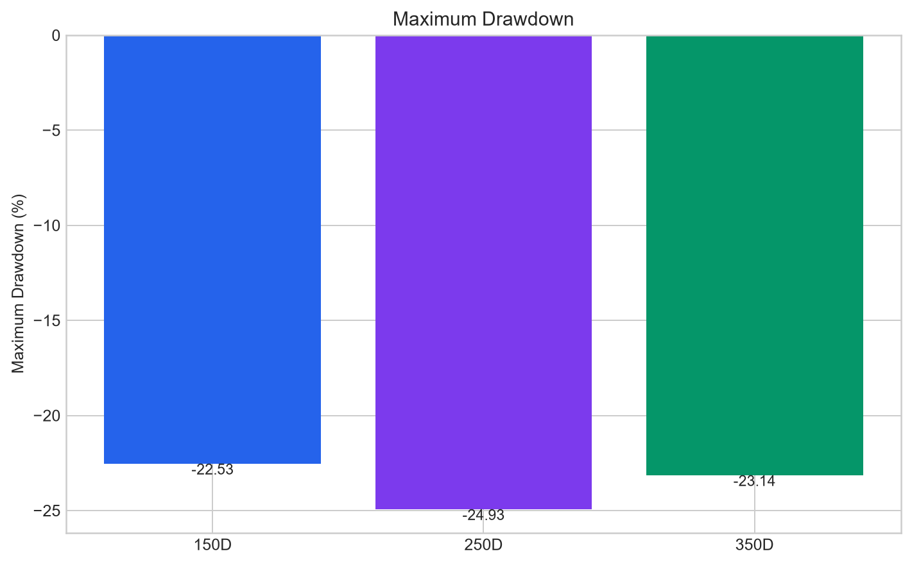
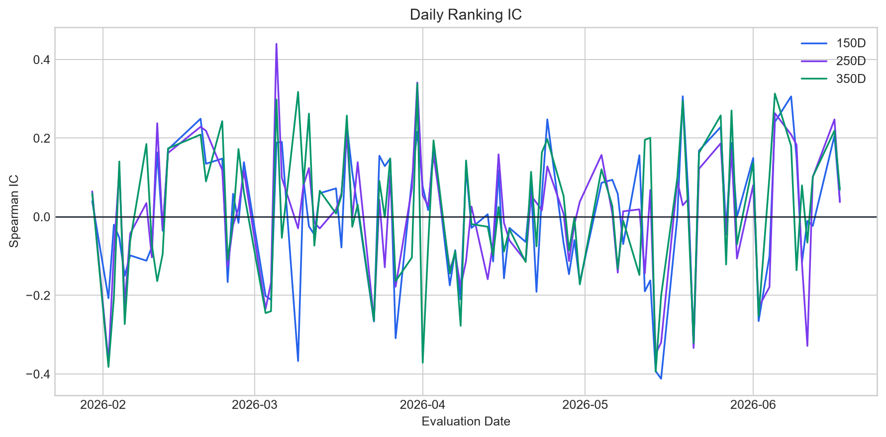
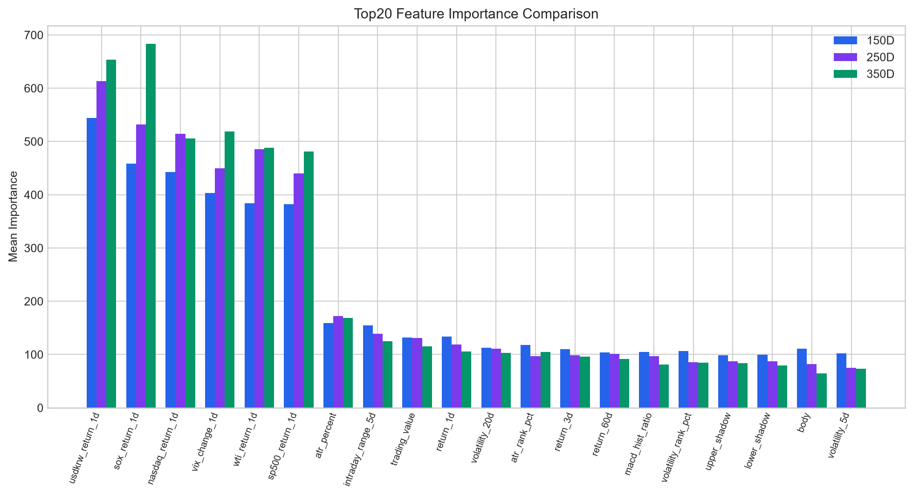

# Rolling Window Comparison: 150D vs 250D vs 350D

## Section 1. Executive Summary

This report compares three rolling training windows for the production AI Trading System: 150, 250, and 350 trading days. The evaluation uses the already generated latest 90 trading-day walk-forward replay outputs. The feature formulas, model architecture, Ranking/Gap/Intraday models, prediction path, and Top10 selection logic are unchanged; only the rolling training-window length differs.

- Evaluation period: 2026-01-30 to 2026-06-17
- Evaluation days: 90
- Prediction rows per window: 31,319
- Feature count: 55
- Top10 rule: ranking_score descending, equal-weight one trading-day hold for portfolio simulation

## Section 2. Performance Comparison Table

| Metric                      |         150D |         250D |          350D | Best   | Worst   |
|:----------------------------|-------------:|-------------:|--------------:|:-------|:--------|
| Ranking RMSE                |     0.056923 |     0.05326  |      0.053798 | 250D   | 150D    |
| Ranking IC                  |     0.001446 |     0.004195 |      0.010649 | 350D   | 150D    |
| Gap RMSE                    |     0.033015 |     0.030363 |      0.030596 | 250D   | 150D    |
| Gap Direction Accuracy      |     0.525464 |     0.543312 |      0.5489   | 350D   | 150D    |
| Intraday RMSE               |     0.04483  |     0.043295 |      0.04321  | 350D   | 150D    |
| Intraday Direction Accuracy |     0.485424 |     0.488489 |      0.46665  | 250D   | 350D    |
| Top10 Average Return        |     0.002193 |     0.006152 |      0.009768 | 350D   | 150D    |
| Portfolio CAGR              |     0.358781 |     2.66861  |      8.22837  | 350D   | 150D    |
| Portfolio Sharpe            |     0.786846 |     2.20113  |      3.64132  | 350D   | 150D    |
| Maximum Drawdown            |    -0.225313 |    -0.249273 |     -0.231373 | 150D   | 250D    |
| Win Rate                    |     0.5      |     0.555556 |      0.611111 | 350D   | 150D    |
| Training Rows               | 52172        | 86835.5      | 121260        | n/a    | n/a     |
| Training Time               |   267.214    |   347.143    |    415.27     | 150D   | 350D    |
| Prediction Time             |     1.23808  |     1.29153  |      1.28266  | 150D   | 250D    |

Best values are selected by the metric direction: lower error/cost is better, while higher IC, hit rate, Sharpe, CAGR, win rate, and less-negative drawdown are better.

## Section 3. Portfolio Comparison

| Metric               | 150D    | 250D    | 350D    |
|:---------------------|:--------|:--------|:--------|
| Cumulative Return    | 11.57%  | 59.08%  | 121.15% |
| CAGR                 | 35.88%  | 266.86% | 822.84% |
| Sharpe               | 78.68%  | 220.11% | 364.13% |
| Average Daily Return | 0.22%   | 0.62%   | 0.98%   |
| Volatility           | 4.42%   | 4.44%   | 4.26%   |
| Maximum Drawdown     | -22.53% | -24.93% | -23.14% |
| Win Rate             | 50.00%  | 55.56%  | 61.11%  |

The 350D window produces the strongest portfolio path in this replay: highest CAGR, highest Sharpe, highest average daily return, best win rate, and least severe drawdown among the three windows.

## Section 4. Ranking Model Comparison

| Metric         | 150D   | 250D   | 350D   |
|:---------------|:-------|:-------|:-------|
| Ranking IC     | 0.14%  | 0.42%  | 1.06%  |
| Ranking RMSE   | 5.69%  | 5.33%  | 5.38%  |
| Top10 Hit Rate | 8.11%  | 9.56%  | 8.22%  |
| NDCG@10        | 46.43% | 47.84% | 48.56% |

Ranking IC remains modest across all windows. The 350D window does not dominate by IC alone, but it converts ranking output into stronger Top10 portfolio performance and better risk-adjusted returns. The 250D window has the best Top10 hit rate, while the 350D window has the best portfolio realization.

## Section 5. Feature Importance

Common Top20 important features across all three windows:

- atr_percent
- atr_rank_pct
- intraday_range_5d
- lower_shadow
- macd_hist_ratio
- nasdaq_return_1d
- return_1d
- return_3d
- return_60d
- sox_return_1d
- sp500_return_1d
- trading_value
- upper_shadow
- usdkrw_return_1d
- vix_change_1d
- volatility_20d
- volatility_rank_pct
- wti_return_1d

Features with the largest importance changes across windows:

| feature             |   150D Importance |   250D Importance |   350D Importance |   Importance Range |
|:--------------------|------------------:|------------------:|------------------:|-------------------:|
| sox_return_1d       |           458     |          531.667  |          683.667  |           225.667  |
| vix_change_1d       |           403.333 |          450      |          518.667  |           115.333  |
| usdkrw_return_1d    |           544.333 |          613      |          653.667  |           109.333  |
| wti_return_1d       |           383.667 |          485.667  |          488.333  |           104.667  |
| sp500_return_1d     |           382     |          439.667  |          481.333  |            99.3333 |
| nasdaq_return_1d    |           442.333 |          514.667  |          506      |            72.3333 |
| body                |           110.667 |           82      |           64.3333 |            46.3333 |
| return_20d_rank_pct |            60     |           46.6667 |           29      |            31      |
| intraday_range_5d   |           154.333 |          138.667  |          124.667  |            29.6667 |
| volatility_5d       |           102.333 |           75.3333 |           73.6667 |            28.6667 |

Macro and technical/cross-sectional features remain prominent. Importance levels shift with longer history, which is expected because regime sensitivity changes as the rolling window expands.

## Section 6. Strengths / Weaknesses

### 150D

Advantages:
- Lowest total training time
- Smallest rolling dataset and simplest daily retrain footprint
- Useful as the fastest fallback research window

Disadvantages:
- Weakest portfolio CAGR and Sharpe among the three
- Highest ranking RMSE
- Lower Top10 hit rate than 250D

### 250D

Advantages:
- Best Top10 hit rate among the three
- Lowest Gap RMSE among the three
- Balanced operating cost and model history

Disadvantages:
- Lower portfolio CAGR and Sharpe than 350D
- Ranking IC is weaker than 150D/350D in this replay
- More training cost than 150D without leading portfolio performance

### 350D

Advantages:
- Best portfolio CAGR, Sharpe, average daily return, and win rate
- Best maximum drawdown among the three
- Best intraday RMSE among the three

Disadvantages:
- Highest training cost among the three
- Ranking IC is positive but not materially strong
- More historical data may adapt slower if regime changes sharply

## Section 7. Recommendation

Recommended production rolling window: **350 trading days**.

Rationale: The recommendation balances prediction quality, portfolio performance, drawdown, stability, training cost, and operational simplicity. In this comparison, the 350D window is the strongest production candidate because it delivers the best risk-adjusted Top10 portfolio results while preserving the same leakage-free production replay setup.

## Final Conclusion

- Gold: 350D
- Silver: 250D
- Bronze: 150D

Overall winner: **350D**. Runner-up: **250D**. Not recommended as the primary production setting from this comparison: **150D**, primarily because its portfolio/risk-adjusted performance is weaker relative to the alternatives in the latest 90-trading-day replay.

## Source Artifacts

- reports/window_comparison/window_150/metrics_summary.json
- reports/window_comparison/window_150/portfolio_returns.csv
- reports/window_comparison/window_150/daily_top10.csv
- reports/window_comparison/window_150/feature_importance_average.csv
- reports/window_comparison/window_250/metrics_summary.json
- reports/window_comparison/window_250/portfolio_returns.csv
- reports/window_comparison/window_250/daily_top10.csv
- reports/window_comparison/window_250/feature_importance_average.csv
- reports/window_comparison/window_350/metrics_summary.json
- reports/window_comparison/window_350/portfolio_returns.csv
- reports/window_comparison/window_350/daily_top10.csv
- reports/window_comparison/window_350/feature_importance_average.csv